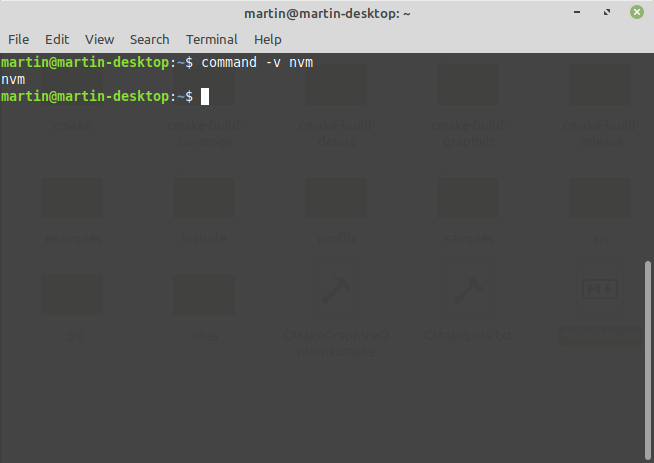

# Instalace node a npm

## Linux
Pro demo jsem požil Mint, mám však za to, že na ostatních distribucích to bude obdobné.

Je možné node zbuildit ze source, přápadně nainstalovat pomocí package manageru (např `apt get intall...`).

Doporučil bych však jiný způsob, který doufám není o mnoho složitější a dá nám trochu víc flexibility.
Použil bych [nvm](https://github.com/nvm-sh/nvm) - node version manager.

Mají pěkné README, přesto zde pro přehlednost vykopíruji commandy, které je potřeba copy-pastnout:

```shell script
wget -qO- https://raw.githubusercontent.com/nvm-sh/nvm/v0.36.0/install.sh | bash
```

a následně:

```shell script
export NVM_DIR="$([ -z "${XDG_CONFIG_HOME-}" ] && printf %s "${HOME}/.nvm" || printf %s "${XDG_CONFIG_HOME}/nvm")"
[ -s "$NVM_DIR/nvm.sh" ] && \. "$NVM_DIR/nvm.sh" # This loads nvm
```

Nakonec se ujistěte, že jste nainstalovali nvm správně:
```
command -v nvm
```

Výstup by měl vypada nějak takto:


Pro help k nástroji nvm zavolejte `nvm` bez parametrů.

Pro instalaci node zavolejte:
```shell script
nvm install --lts
```
Nakonec se můžete ujistit, že skutečně používáte správnou verzi:


## Windows
Pro větší flexibilitu bych použil [nvm-windows](https://github.com/coreybutler/nvm-windows). Node version manager pro windows.
Nainstalujete ho pomocí instalačky [zde](https://github.com/coreybutler/nvm-windows/releases/download/1.1.7/nvm-setup.zip).

