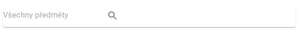
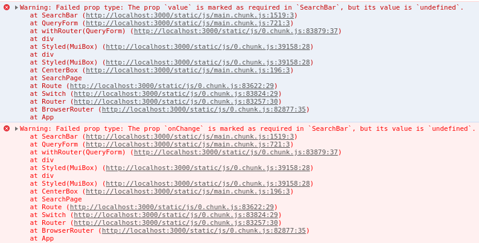
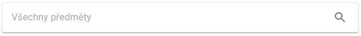

# Vývoj

Při vývoji je nutné mít chceckoutnutou správnou branch. Následně je potřeba nejprve zavolat
(lze tak učinit v terminálu přímo ve Webstrom). 
```
npm install
```
Pozor toto může trvat i celkem dlouho.

Pro spuštěná serveru na localhost zavolejte:
```
npm start
```
Tento command by default spustí server na [localhost:3000](http://localhost:3000/). Na tomto
odkazu tedy existuje naše stránka.

## První krůček

Jako první krůček doporučuji otevřít file `src/Logo.js` a změnit text:
```javascript
<Link href="#" onClick={(e) => {e.preventDefault(); history.push("/");}} className={classes.link}>
    PŘEDMĚTY
</Link>
```

Toto změna by se měla automaticky promítnout na vzhledu stránky.

## Tutoriály

S [tutoriálem](https://reactjs.org/tutorial/tutorial.html) na officiálním webu se nespletete.
Statefull componenty jsou zde řešeny pomocí Class components. Zde bych se přikláněl
spíše k používání [hooků](https://reactjs.org/docs/hooks-intro.html). Snad by neměl být
problém pochopit věci pomocí classes a napsat je pomocí hooků - koncepčně je to stejné,
jen kód je jiný.

## Příklad implementace search bar
Důležité je jednoznačné zadání. Chceme komponent, který bude vracet render vzhledu
klasického search baru a bude mít dvě properties: `value` `a onChange`.
Tyto dvě props jsou v Reactu typické pro jakýkoliv input.

Nejprve je třeba vytvořit file `SearchBar.js` ve složce `src`. V tomto file
si udělat základní kostru komponentu.
```javascript
import React from 'react';
import PropTypes from 'prop-types';

const SearchBar = props => {
    return (
        <div>

        </div>
    );
};

SearchBar.propTypes = {
    
};

export default SearchBar;
```
Ve Webstrom lze toto udělat automaticky. Stačí napsat `rspc` - react stateless
proptypes component a zmáčknout tab. Props známe ze zadání, takže je můžeme
rovnou doplnit
```javascript
const SearchBar = ({value, onChange}) => {
    return (
        <div>

        </div>
    );
};

SearchBar.propTypes = {
    value: PropTypes.string.isRequired,
    onChange: PropTypes.func.isRequired
};
```
Povšiměte si zvláštní notace parametrů lambdy uložené do SerachBar, místo
```javascript
const SearchBar = props => {
    const value = props.value;
    const onChange = props.onChange;
    ...
}
```
je použito
```javascript
const SearchBar = ({value, onChange}) => {
    ...
};
```
Funkce kódu je tototžná, ale tato notace šetří místo. Toto jsou drobnosti, na které
je ale třeba dávat pozor, abychom byli konzistentní, krásní a všeobecně famfárový.

Další věc, která je zde použita jsou PropTypes. Tento mechanismus nám umožnuje zadat
jaké typy props komponent očekává. To je velmi užitečné při spolupráci více lidí.
Mějte na paměti, že PropTypes jsou checkovány pouze v debug módu, v release módu
jsou ignorovány. To šetří výkon reálné aplikace. Aplikace spuštěná pomocí
`npm start` je v debug módu by default. Aplikace vytvoření pomocí `npm run build`
je v release módu. Jaké všechny typy PropTypes lze zadat vám napoví Webstorm,
případně je možné nahlédnout do
[dokumentace](https://reactjs.org/docs/typechecking-with-proptypes.html).

Následně je vhoné přidat komponent do zbytku kódu, tak abychom viděli jeho render
```javascript
import SearchBar from "./SearchBar";

...

<Box component="form" onSubmit={handleSubmit}>
    <SearchBar />
    ...
</Box>
```
Zde konkrétně je toto ve file `QueryFrom.js`. Řádek `import SearchBar from "./SearchBar";`
importne náš komponent, protože jsme nastavili `export default SearchBar;`.

Následně lze implementovat základní render, zde jsou použity komponenty z Material UI
```javascript
const SearchBar = ({value, onChange}) => {
    return (
        <Paper>
            <InputBase
                placeholder="Všechny předměty"
                inputProps={{'aria-label': 'Vyhledat předměty'}}
                value={}
                onChange={() => {}}
            />
            <IconButton type="submit" aria-label="Vyhledat">
                <SearchIcon/>
            </IconButton>
        </Paper>
    );
};
```
Tady je ne přiliš dobře vypadající výsledek dosavadního snažení



Navíc jsou v konzoli warningy



Tyto warningy jsou zcela očekávané a žádoucí. Skutečně jsme nedefinovali žádné
props i přesto, že jsou required.

Nejprve je opraven vzhled
```javascript
const useStyles = makeStyles((theme) => ({
    root: {
        padding: '3px 8px',
        display: 'flex',
        alignItems: 'center',
        border: '1px solid #E9E9E9',
        width: '600px'
    },
    input: {
        marginLeft: theme.spacing(1),
        flex: 1,
    },
    icon: {
        padding: 10,
    },
}));

const SearchBar = ({value, onChange}) => {
    const classes = useStyles();
    return (
        <Paper className={classes.root}>
            <InputBase
                className={classes.input}
                placeholder="Všechny předměty"
                inputProps={{'aria-label': 'Vyhledat předměty'}}
                value={}
                onChange={() => {}}
            />
            <IconButton type="submit" className={classes.icon} aria-label="Vyhledat">
                <SearchIcon/>
            </IconButton>
        </Paper>
    );
};
```

Způsobů jak toto udělat je nespočet, ale zde se budeme držet způsobu z dokumntace
Material UI (tento postup má několik výhod).
Je definován hook `useStyles`. Toto doporučuji copy and pastnout
(samozřejmě s definicí vlastních classes). Tento hook je použit pomocí:
`const classes = useStyles();`, classes jsou pak přiřazeny pomocí atributu
`className={classes.root}`. Držel bych se zadávaní absolutních velikostí (př. `600px`).
Bude li parent compoent potřebovat tuto velikost změnit tak může, ne nadarmo 
použáváme kaskádové styly. V ideálním případě by ale parent měl jen skládat
children. Tak abychom nevytvýřeli zbytečné style dependence. Na zařízeních
o různé velikosti vyřešíme kompatibilitu pomocí media queries
(to je ale na jiné povíádaní).

Výsledek uměleckého snažení je zde

 

Zbývá zajistit funkcionalitu a dopsat dokumentaci. Funkcinalitu je zajištěna napsáním
```javascript
const SearchBar = ({value, onChange}) => {
    const classes = useStyles();
    const handleChange = (e) => {
        e.preventDefault();
        onChange(e.target.value);
    };
    return (
        <Paper className={classes.root}>
            <InputBase
                className={classes.input}
                placeholder="Všechny předměty"
                inputProps={{'aria-label': 'vyhledat předměty'}}
                value={value}
                onChange={handleChange}
            />
            <IconButton type="submit" className={classes.icon} aria-label="Vyhledat">
                <SearchIcon/>
            </IconButton>
        </Paper>
    );
};
```
Value `value` je jen přiřazena. Dále, když se změní hodnota imputu tak je nyní
zavolána funkce `handleChange`, která dostane od DOMu parametr `e: event`.
Je zakázanáno aby se stalo cokoliv by default `e.preventDefault()` (v případě
submitu třeba refresh stránky) a je získána value inputu, která je poslána dál.
`onChange(e.target.value);`. Následně jsou props použity v parent componentu.
```javascript
<SearchBar value={query} onChange={(value) => {setQuery(value)}} />
```
Konkrétní hodnoty jsou starost parent compomentu. Po dopsání dokumntace
je toto finální verze komponentu připravena na review:

```javascript
import React from 'react';
import PropTypes from 'prop-types';
import InputBase from "@material-ui/core/InputBase";
import IconButton from "@material-ui/core/IconButton";
import SearchIcon from "@material-ui/icons/Search";
import Paper from "@material-ui/core/Paper";
import {makeStyles} from "@material-ui/core/styles";

const useStyles = makeStyles((theme) => ({
    root: {
        padding: '3px 8px',
        display: 'flex',
        alignItems: 'center',
        border: '1px solid #E9E9E9',
        width: '600px'
    },
    input: {
        marginLeft: theme.spacing(1),
        flex: 1,
    },
    icon: {
        padding: 10,
    },
}));

/**
 * View component displaying a search bar
 */
const SearchBar = ({value, onChange}) => {
    const classes = useStyles();
    const handleChange = (e) => {
        e.preventDefault();
        onChange(e.target.value);
    };
    return (
        <Paper className={classes.root}>
            <InputBase
                className={classes.input}
                placeholder="Všechny předměty"
                inputProps={{'aria-label': 'Vyhledat předměty'}}
                value={value}
                onChange={handleChange}
            />
            <IconButton type="submit" className={classes.icon} aria-label="Vyhledat">
                <SearchIcon/>
            </IconButton>
        </Paper>
    );
};

SearchBar.propTypes = {
    /** value displayed in the search bar */
    value: PropTypes.string.isRequired,
    /** function taking string value as a param triggered when a user changes the input*/
    onChange: PropTypes.func.isRequired
};

export default SearchBar;
```
