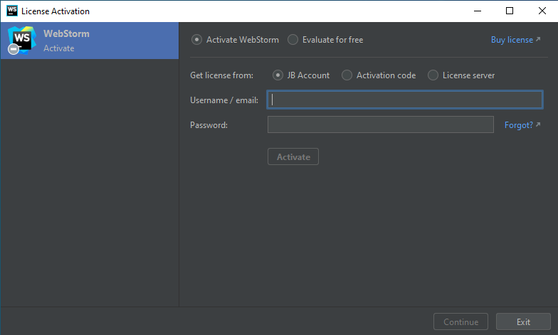
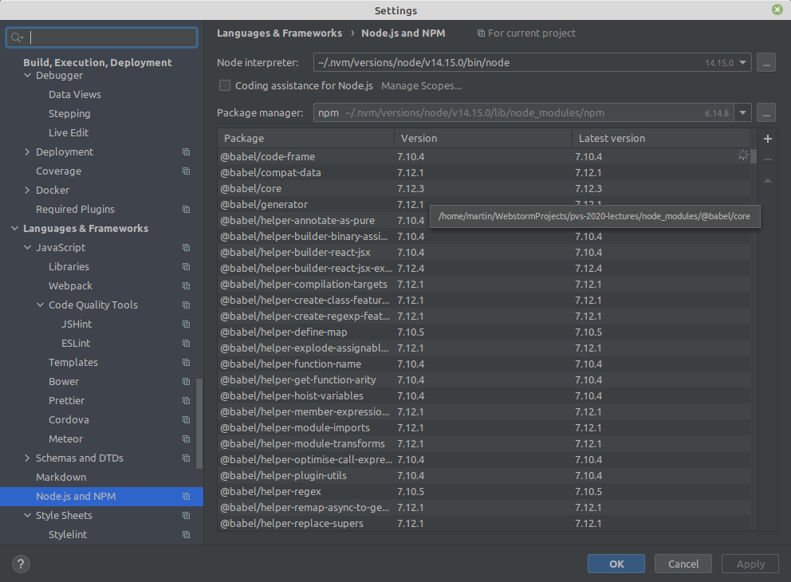
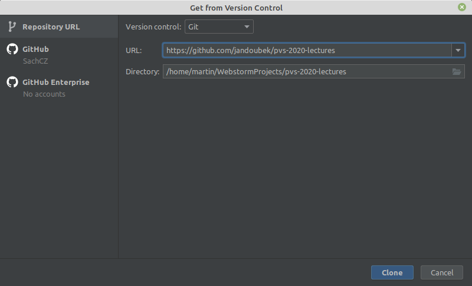

# Webstorm

## Instalace
Nainstalovat Webstorm by neměl být problém. Je třeba založit si účet a přidat isic, pro studentskou verzi. Pak se stačá přihlásit při vyzvání:

## Používání Webstorm
Před používáním se **ujistěte**, že máte nainstalovaný node a npm.
Pokud ne obraťte se na návod [zde](install_node.md).

Hned po spuštění Webstorm zkontrolujte, že Webstorm správně nalezl node a npm a to tak, že přejdete do
`file > settings Node.js and NPM` a zde se ujistěte, že jsou zvoleny verze, které jste nainstalovali.
**Nepřeskakujte tento krok**.

.

### Existujcí projekt
Existující projekt (tj. dir kam jste naklonovali projekt) otevřete snadno ve `File > Open...`.

### Projekt z github
Pro inicializaci objektu z githubu doporučuji nástroj `VCS > Get From Version Control...`.
Zde zadáte odkaz na projekt a vše se samo inicializuje:

### Přepínání branches

V pravo dole je možnost přepínat branche. Default je main - na tuto kliknete a měl by se zobrazit
seznam local a remote branches. Zde je možné kliknout na branch (např. origin/react-example)
a zvolit chceckout.

Pro vyhnutí se komplikacím, nejjednudušší je mít včechny změny v current branchi comitnuté,
před checkoutem.